# Alex Makasighe

**Software Engineer | Go • Node.js • Rust • React • Next.js • Vue • Svelte**

Building scalable systems, modern web applications, and performance-focused solutions.

---

## About Me

I am a Software Engineer passionate about building reliable, maintainable, and scalable applications across the entire technology stack.

My experience spans backend development, frontend engineering, performance testing, and software architecture. I enjoy solving complex technical problems and continuously exploring new technologies to build better systems.

### Current Interests

- Backend Engineering
- Performance Engineering
- Modern Web Development
- Software Architecture
- Distributed Systems
- Artificial Intelligence
- Developer Experience

---

## Technology Stack

### Backend

  
  
  
  

### Frontend

  
  
  
  

### Database

  
  
  

### DevOps & Infrastructure

  
  
  
  

### Performance Engineering

- K6
- Load Testing
- Stress Testing
- Benchmarking
- Performance Analysis
- Capacity Planning

### AI Engineering

- Python
- OpenAI API
- Retrieval-Augmented Generation (RAG)
- Vector Databases
- LLM Applications

---

## Featured Projects

### CCTV Monitoring Platform

Real-time monitoring platform designed for stream lifecycle management and operational visibility.

**Highlights**

- Real-time monitoring
- Session lifecycle management
- REST API architecture
- Docker deployment
- PostgreSQL integration

**Tech Stack**

Go • PostgreSQL • Docker • WebSocket

---

### K6 Performance Testing Platform

A performance testing framework designed to automate benchmarking and capacity validation.

**Highlights**

- Automated load testing
- Performance metrics collection
- Reporting and analytics
- CI/CD integration

**Tech Stack**

Go • K6 • PostgreSQL • Grafana

---

### Modern Web Dashboard

Responsive and scalable dashboard application with modern frontend architecture.

**Highlights**

- Reusable components
- Real-time updates
- Responsive UI
- Type-safe development

**Tech Stack**

React • Next.js • TypeScript

---

### AI Knowledge Assistant

An intelligent knowledge retrieval system powered by Retrieval-Augmented Generation (RAG).

**Highlights**

- Semantic search
- Context-aware retrieval
- Vector search
- LLM-powered responses

**Tech Stack**

Python • OpenAI • Vector Database

---

## Engineering Principles

- Simplicity over unnecessary complexity
- Reliability before optimization
- Automation wherever possible
- Performance as a feature
- Maintainability at scale
- Continuous learning and improvement

---

## Areas of Interest

- Software Architecture
- Distributed Systems
- Concurrency & Parallelism
- High Performance APIs
- Performance Engineering
- Observability
- DevOps
- Artificial Intelligence

---

## Open Source

I actively learn from and contribute to the open-source ecosystem through software projects, tooling, documentation, and community collaboration.

---

## GitHub Metrics

---

## Current Focus

- Building scalable backend services with Go and Rust
- Developing modern web applications with React and Next.js
- Advancing performance engineering practices with K6
- Exploring production-ready AI systems
- Improving software architecture and system design skills

---

## Contact

- LinkedIn: https://linkedin.com/in/alex-makasighe-7381051a5
- Email: alexmakasighe2@gmail.com

---

## Philosophy

> Build maintainable software. Optimize where it matters. Keep complexity under control.
